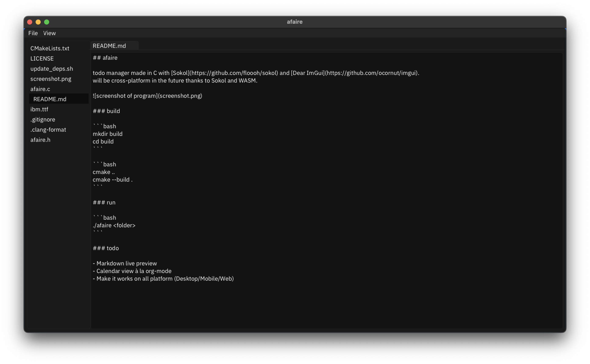

## afaire

todo manager made in C with [Sokol](https://github.com/floooh/sokol) and [Dear ImGui](https://github.com/ocornut/imgui).
will be cross-platform in the future thanks to Sokol and WASM.



### build

```bash
mkdir build
cd build
```

```bash
cmake ..
cmake --build .
```

### run

```bash
./afaire <folder>
```

### todo

- Open multiple files at the same time (tabs)
- Markdown live preview
- Calendar view à la org-mode
- Make it works on all platform (Desktop/Mobile/Web)
